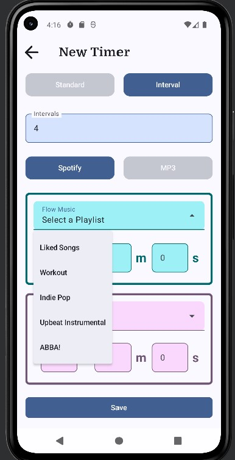

# Music Timer App

Music Timer is an Android application designed to combine the utility of timers and alarms with the motivational power of music. Whether you're studying, working out, focusing on a task, or managing your day, Music Timer helps you stay on track with personalized music playback.

## Screenshots
**Timers Playing**

  
  
  
  

(1) Interval timer flow interval (2) Playing timer options (3) Interval timer break interval (4) Standard timer 
   

**Timer Entry and Other Displays**

  
  
  
  

(1) Creating a timer (2) Creating a quick timer (3) View timers (4) Home page with no playing timer

## Features

### (1) Create Timers and Alarms 

- Customize timers for specific durations or set alarms to play your favorite tracks.

- Support for interval timers to structure work and break sessions.

### (2) Music Integration

- Play your favorite music tracks during timer sessions or alarms to enhance focus and motivation.

- Support to create playlist using local mp3 files.

- Support to connect to a Spotify account. 

### (3) System UI Integration

- Smooth integration with the Android system UI for seamless control and notifications.

- Allows control from the android home screen to easily view and modify the state of a playing timer. 

### (4) Foreground Service for Media Playback

- Ensures uninterrupted music playback, even when the app is minimized or the screen is off.

### (5) Highly Customizable

- Perfect for general daily use, studying, workout routines, or as a focus helper for neurodivergents.

- Dark and Light modes avaliable, and main app colours are customizable. 

## Technical Overview

- Platform: Android (Built with Kotlin Jetpack Compose).

- Device Support: Compatible with Android SDK 24 (Android 7.0) and above.

- Architecture: Utilizes modern development practices, including dependency injection with Hilt.

- Data Management: Stores data locally with Android Room and SQL for efficiency.

- Media Playback: Implements foreground services to ensure reliable playback.

## Showcase

This repository is intended to showcase my skills and experience in Android development. While the source code is not included, the application demonstrates:

- Proficiency in Android development with Kotlin.

- Experience with modern Android frameworks and libraries.

- Ability to create functional, user-friendly, and visually appealing applications.

- Knowledge of integrating system-level features like media playback and alarms.

## Use Cases

1. Daily Use: Set alarms and timers to manage your day effectively.

2. Studying: Stay focused with interval timers flow music to power through tasks, and break music to accompany a brain break. 

3. Workouts: Create interval timers for workouts with energizing or calming music to match work and rest intervals. 

4. Focus Aid: Ideal for neurodivergent individuals or anyone needing help maintaining focus during tasks.

## Contact

For questions, feedback, or collaboration opportunities, feel free to reach out via miadallan22@gmail.com.

*Note: The Music Timer application is a functional project designed to demonstrate practical Android development skills. It represents real-world experience with building and delivering quality software solutions.
An application to play timers, interval timers, and alarms with music.*
